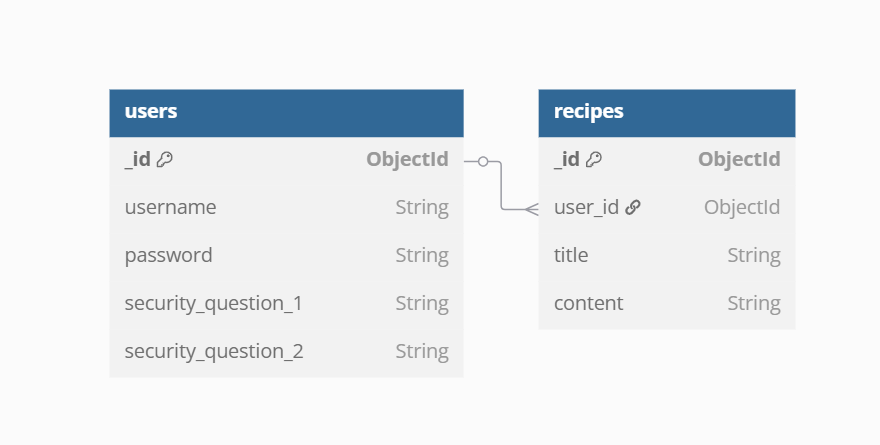
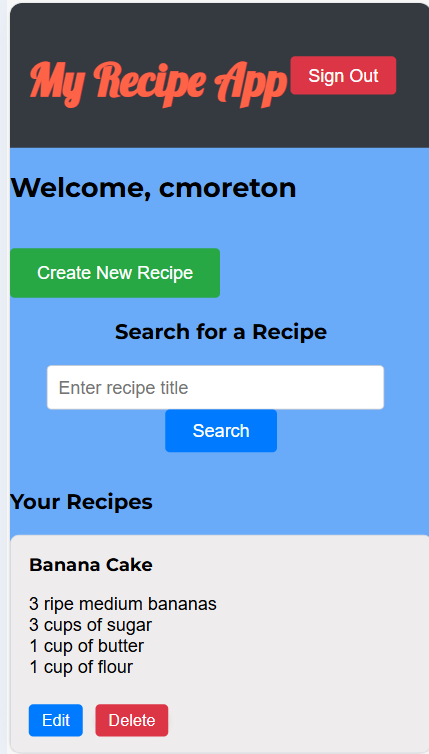
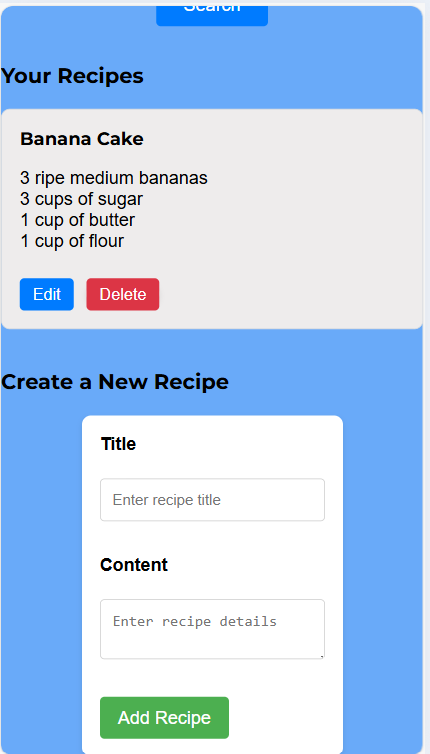
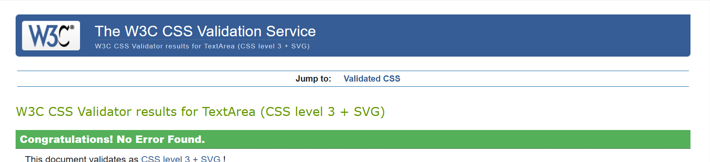
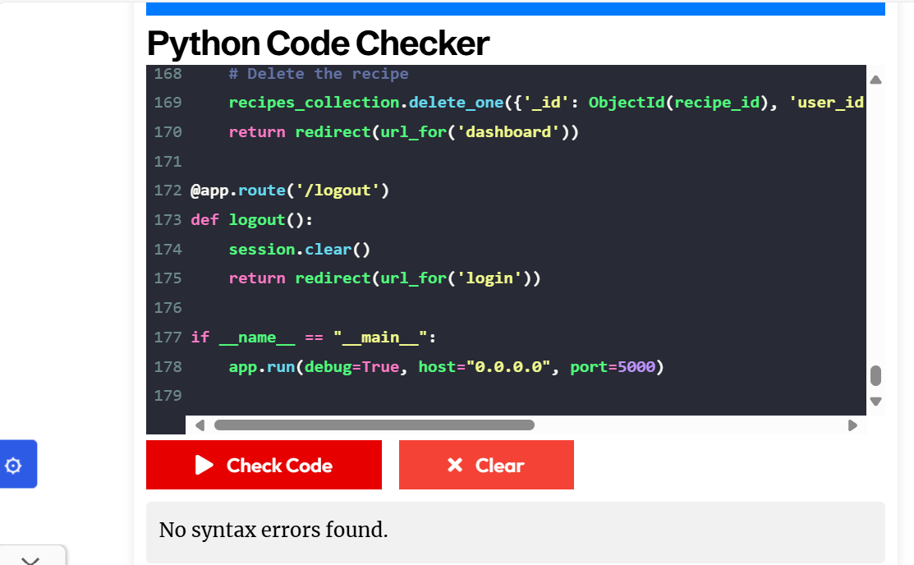
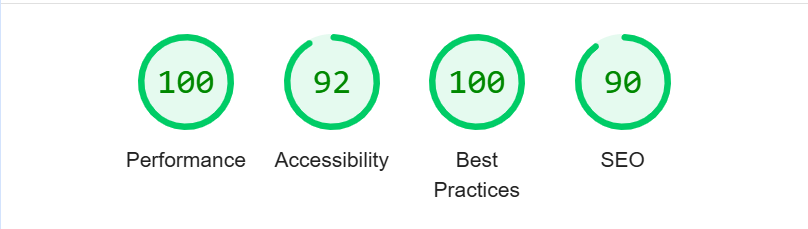
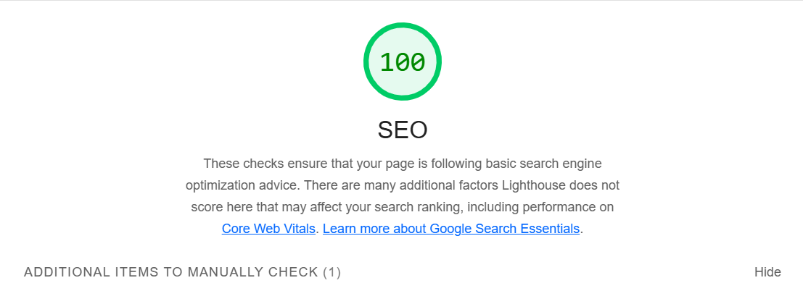
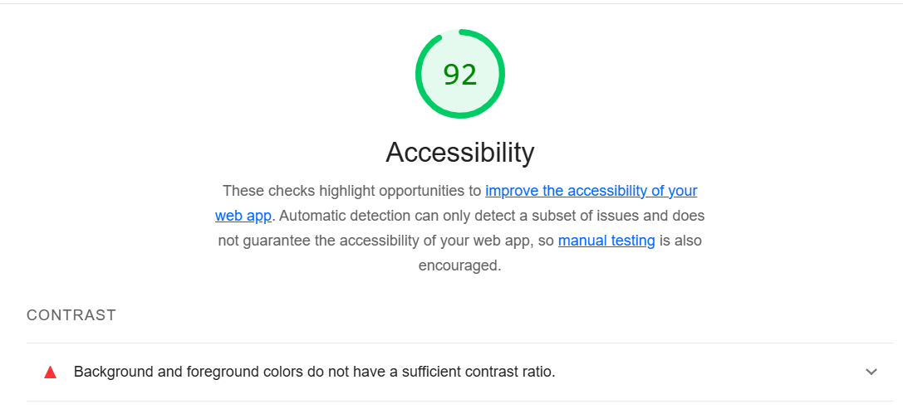

# [MyRecipeApp: Personal Recipe Collection App](https://my-recipes-app-6ea7c43fa6df.herokuapp.com/login)

# Project Overview

[MyRecipeApp](https://my-recipes-app-6ea7c43fa6df.herokuapp.com/login) is a [Flask](https://flask.palletsprojects.com/en/stable/)-based [CRUD](https://www.codecademy.com/article/what-is-crud) application that lets users manage their recipe collection with ease of use. Users can create secure accounts or log in using hashed passwords powered by [bcrypt](https://flask-bcrypt.readthedocs.io/en/1.0.1/), and perform actions like adding, editing, deleting, and searching for recipes that havebeen stored in a [MongoDB](https://www.mongodb.com/) database. The app features a dynamic and responsive interface styled with custom css, while [JavaScript](https://www.w3schools.com/js/DEFAULT.asp) enhances interactivity by animating the flashing effect when searching for recipes. My Reciep App allows for an intuitive experience for managing your recipes in a secure account authenticated by a password and data that is managed in a collection. This allows for posiitve user experiences and ease of use.

**Key Features:**
- User Authentication & Security: Leverages Flask-Bcrypt for secure password hashing and implements a safe login and registration process.
- Dynamic Recipe Management: Easily add, edit, delete, and view recipes in a personalized collection with full CRUD functionality.
- User-Centric Dashboard: Provides a customized experience where users can manage their recipes efficiently.
- Recipe Search Optimization: Fast and intuitive recipe search feature, allowing users to quickly find their dishes.
- MongoDB Integration: Utilizes MongoDB to store and manage user and recipe data, ensuring scalability and performance.
- Role-Based Access Control: Ensures secure access with session management, limiting recipe modifications to authenticated users.
- Responsive & Accessible Design: Built with a mobile-first approach, ensuring seamless navigation on all devices with a clean and modern UI.

**Purpose:**
- The purpose of this project is to create a site where users can store their own recipes and edit them as they wish. this allows users to keep up to date recipe examples and access them with ease.
- The purpose of the user for this website is so that they can have their own recipes stored and access them with ease.

## UX

When designing a CRUD-based application, a recipe management system offers a compelling and user-centric experience. It allows users to efficiently create, view, edit, and delete their own recipes in a structured, easy-to-navigate environment. The key UX challenge lies in creating a seamless flow for users to interact with their recipe collection, whether they are adding new recipes, searching through them, or modifying existing entries.

The project also introduces personalized user authentication, giving users the ability to manage their own recipes securely. This adds an extra layer of complexity, as the design must account for features like login, session management, and ensuring that users can only access their own recipes. This personalized experience strengthens user interaction, providing the feeling of ownership and control over the data they create.

### Color Scheme

The chosen color palette is designed to create a visually engaging and user-friendly experience while maintaining a clean and modern look. The combination of contrasting colors ensures clear readability, intuitive navigation, and an aesthetically pleasing interface that enhances the overall usability of the application.

**1. Background Colors (#343a40, #69aaf9):**
The dark grey header (#343a40) provides a strong and structured feel, creating a sense of focus and organization. In contrast, the vibrant blue background (#69aaf9) adds a fresh and inviting atmosphere, making the interface feel approachable and easy to navigate.

**2. Action Buttons (#dc3545, #4CAF50, #007bff):**
Key actions are color-coded to improve usability. The red (#dc3545) is used for actions requiring caution, such as "delete," ensuring users can easily distinguish critical functions. The green (#4CAF50) is used for positive actions like saving or submitting, reinforcing a sense of confirmation. Blue (#007bff) highlights interactive elements like editing, making them easily identifiable.

**3. Text & Highlight Colors (#fff, #ff6347, #eeecec):**
White (#fff) text is used against dark backgrounds to maximize readability. Titles and key elements feature a striking coral shade (#ff6347), adding a dynamic and engaging touch. The soft grey (#eeecec) in recipe cards ensures content remains clear and easy to read without overwhelming the user.

By combining bold contrast with subtle highlights, this color scheme creates an intuitive and visually appealing experience while maintaining clarity and ease of use.

### Typography

For this project, I selected a combination of Google Fonts that prioritize readability and modern aesthetics. The chosen fonts create a clear visual hierarchy and contribute to a user-friendly experience, ensuring that content is easily digestible while maintaining a clean and contemporary look.

**Heading Typography**

**H1 [Lobster](https://fonts.google.com/specimen/Lobster)**
I used Lobster for the main title (H1) to give it a bold, playful touch. The cursive design adds character and makes the title stand out in a unique way, giving the page an engaging and inviting feel.

**Subheadings [H2-H6: Montserrat](https://fonts.google.com/specimen/Montserrat)**
Montserrat was chosen for subheadings due to its clean and modern design. It’s easy to read and structured, ensuring the content is well-organized while maintaining a professional and polished appearance.

**Body Text [Open Sans](https://fonts.google.com/specimen/Open+Sans)**
For the body text, I used Open Sans, a highly readable sans-serif font. Its simple and neutral design ensures clarity and legibility, making it ideal for longer text content and enhancing the overall user experience.

**Fallback Font: Sans-serif**
In the event that the primary fonts are unavailable, I’ve set a fallback to sans-serif. This ensures that the text remains clean, simple, and easy to read across all devices, maintaining a consistent user experience.

## Data Schema 
**User Collection**
### `users` Collection Schema

| Field                    | Type      | Description                                                 |
|--------------------------|-----------|-------------------------------------------------------------|
| `_id`                    | ObjectId  | Unique user ID (generated automatically by MongoDB)         |
| `username`               | String    | User-chosen unique username                                 |
| `password`               | String    | Hashed password for authentication                          |
| `security_question_1`    | String    | Answer to the first security question                       |
| `security_question_2`    | String    | Answer to the second security question                      |

- Users Collection (users)
The users collection stores authentication and security details for each user. Each document in the collection represents a user and contains the following fields:

_id: A unique identifier automatically generated by MongoDB.

username: The username chosen by the user, which must be unique across the collection.

password: The hashed password for the user, stored securely.

security_question_1: The answer to the first security question, used for password recovery.

security_question_2: The answer to the second security question, also used for password recovery.

**Recipes Collection**
### `recipes` Collection Schema

| Field    | Type      | Description                                              |
|----------|-----------|----------------------------------------------------------|
| `_id`    | ObjectId  | Unique recipe ID (generated automatically by MongoDB)    |
| `user_id`| ObjectId  | References the user's `_id` (links recipe to its creator) |
| `title`  | String    | Recipe title (User-provided)                             |
| `content`| String    | Recipe instructions or description (User-provided)       |

- Recipes Collection (recipes)
The recipes collection stores user-created recipes. Each document represents a recipe and includes:

_id: A unique identifier for each recipe, automatically generated by MongoDB.

user_id: A reference to the user who created the recipe (links to the _id of the user in the users collection).

title: The title or name of the recipe.

content: The detailed instructions or description of how to prepare the recipe.

- Relationships
Each user can have multiple recipes (One-to-Many relationship), and each recipe is associated with one specific user.

The user_id in the recipes collection references the _id of a user in the users collection.

## User Stories

### New Site Users

- As a new site user, I want to create an account, so that I can store and organize my recipes securely.
- As a new site user, I want to add my favorite recipes, so that I can easily refer back to them later.
- As a new site user, I want to search for recipes by name, so that I can find recipes that I have previously stored.
- As a new site user, I want to easily manage my recipes and delete the old ones I no longer require.

### Returning Users 

- As a returning user, I want to log into my account, so that I can access my personal recipe collection.
- As a returning user, I want to update a recipe with changes I made or improvements I discovered, so that I can keep my recipes up to date.
- As a returning user, I want to delete or archive recipes that I no longer want to keep, so that my collection stays organized and relevant.
- As a returning user, I want to be able to change my password if i somehow forgot my original.

## Wireframes

In order for best practices to be used, I developed wireframes to potray what the website should look like, I have included desktop and mobile view for frames that require a different layout due to sizing for mobile view.
I have used [Wireframe](https://wireframe.cc) to design the wireframes for my site.

### Desktop Wireframes

### Mobile Wireframe

- My signup and login pages are relatively small in terms of layout so they will look similar if not the same from a mobile view. The dashboard howeevr will require a different layout.

## Features

### Existing Features

-**Login Page**

- The login page is a simple one box for a form that allows the user to type theur username and password to click a button to login.

-**Signup Page**

- The signup page allows the user to set their own username and password as well as two security answers, this page will flag up usernames that already exist and only allow the user to set a username and password above a certain length. Don't forget that when setting security answers, it is case sensitive.

-**Forgot Password Page**

- This page allows the user to get to the reset password page by typing in their username and security question answers.

-**Reset Password Page**

- This page allows the user to reet thir password which will then be updated automatically to allow the user to sign in with their new passord.

-**Dashboard Page**

- This page allows the user to log and store new recipes as well as edit and delete them. The user can sign out and can create new recipes with an add recipe form.

### User Testing
**User Testing**
| Test |Outcome  |
|--|--|
|Users were asked to create and account, all users passed this test|Pass |
|Users were asked to create a new recipe, all users passed this test|Pass |
|Users were asked to try and restet their password, all users passed this test|Pass |

### User Feedback 

- I would like to be able to store ingredients and methods seperately
- I would like to be able to add pictures to my recipes
- I would like to be able to see my friends recipes

### Future Features 

- Recipe Image Upload:
   - Allow users to upload images for their recipes to visually enhance their recipe posts.
- Recipe Sharing with Friends:
   - Enable users to connect with friends, view their recipes, and share their own recipe 
     creations.
- Ingredient & Method Sections:
   - Create separate, clearly labeled sections for users to add ingredients and cooking 
     methods. This will ensure a more structured and organized layout for recipes, making it 
     easier for users to follow the steps.
- Animated or Background Images for the site:
   - Implement an animated or static background image to the site to make it more user friendly and visually appealing.

## Tools & Technologies Used

**Frontend Technologies**
- HTML: The standard markup language for creating web pages.
- CSS: For styling and designing the layout of the web pages.
- JavaScript: For adding interactivity with the flashing effect.
- Google Fonts: To import custom fonts like Lobster, Montserrat, and Open Sans for typography.
- Media Queries: For responsive design to ensure the application works well on various screen 
  sizes, such as tablets and mobile devices.

**Backend Technologies**
- Python: Programming language used for backend development.
- Flask: A lightweight Python web framework for building the backend and handling routing.
- MongoDB: NoSQL database used for storing recipe data, user information, and other       
  site-related content.
- PyMongo: Python library for interacting with MongoDB.
- bcrypt: A library used for hashing passwords securely.
- dbdiagram: For reating my data schema diagram. https://dbdiagram.io/d

**Deployment and Hosting**
- Heroku: Cloud platform for deploying and hosting the web application.
- Git & GitHub: Version control system for managing the codebase and collaboration.
- GitHub Actions: For automating deployment processes, pushing code to Heroku.
- VS code: Migrated to VS code during production.

**Debugging and Validation Tools**
- ChatGPT: Used as a tool for helping with debugging and resolving issues.
- Google Lighthouse: For performance, accessibility, SEO, and best practices audits.
- CSS Validator: For validating and ensuring the correct usage of CSS syntax and styles.
- HTML Validator: For validating HTML code to ensure it meets web standards and is error-free.
- Python Validator: To validate Python code and ensure it adheres to best practices.
- Stack overflow was used to asssit with some code, code edited from stack overflow

## Validation 

**HTML Validation**
- The html code validator brings up multipe errors which are of no concern. These errors are flagging due to the browser only running hmtl without being redereed through flasks tmplate engine. The {{ url_for() }} syntax is part of Flask's template rendering system, which means this code will only work correctly when your HTML files are rendered through Flask's template engine.

**CSS Validator**

- There have been no erros detected in the CSS code.

**Python Validator**

- There have been no errors detected in the python code.

### Lighthouse testing

- This test flagged up only a couple of potential fixes, this included contrasting colors and no meta description, meta description was added however there has been no color edits due to the colors being favoured by website users.

## Database Design
### MongoDB Non-Relational Database

This project uses [MongoDB](https://www.mongodb.com) for the Non-Relational Database.

My project uses a non-relational database (MongoDB), the database doesn't have any actual relationships like a relational database would.

- My databse consists of 2 collections, users and recipes. THe database stores the users information and hashes the password to keep it confidential. The user recipes are added and delted from the database when the user does so.

## Testing

- Testing for this project was completed manually. Testing was done after every new feature was implemented. This made sure I was aware if the new added feature was working correclty.
**Testing for function and links**
| Test |Outcome  |
|--|--|
|The login button when clicked takes users to the dahsboard | Pass
|The forgot password button allows users to reset password with their security answers |Pass|
|The create new recipe button takes users to the recipe form | Pass|
|The edit and delete recipe button allows users to edit and delete recipe| Pass|
|The recipes stack in a row side by side| Pass|
|The log out button takes users back to the login page| Pass|
|IF the user types in the wrong password or username, this site prompts them it is incorrect| Pass|

**Testing for responsiveness**
| Test |Outcome  |
|--|--|
|Test to see if the recipes fit in the page once the page is made smaller |Pass |
|Test to see if on small screens, the recipes adjust to display in rows of two |Pass |

## Deployment
### Heroku 

The live deployed application can be found deployed on [Heroku](https://my-recipes-app-6ea7c43fa6df.herokuapp.com/login).

Heroku requies three additional files in order to deploy properly.

- requirements.txt
- Procfile
- .python-version

### Bugs
. Database Connection Issues
- Problem: Couldn’t connect to MongoDB.
- Fix: Double-check connection string, ensure environment variables for MongoDB URI are set correctly, and confirm the database is accessible.
- Problem: Paths for incorrect login details took the user to seperate page with no return button.
- Fix: Ensure the comments for users incorrect details were displayed on the same page bu editing th file paths and adding an in page error.
- Problem: The layout didn’t look as expected on different devices (e.g., buttons were too large or text was misaligned).
- Fix: Used media queries to adjust the layout for smaller screens.
- Problem: Some pages were not loading or throwing errors.
- Fix: Check route definitions and make sure templates are correctly rendered. Also, ensure 
  assets like CSS and JS files are properly linked, ensure the python link has somewhere to link to.
- Problem: CSS actions not editiing in real time viewing.
- Fix: Clear browser history and cookies and hard refresh page.
- Problem: Logging users out when they pressed add new recipe or edit recipe
- Fix: The secret key was updated to a consistent value ("MyRecipeAppSecretKey") instead of using os.urandom(24). This ensured that session data remained valid across requests, preventing users from being logged out unexpectedly.

### Acknowledgements

- I would like to thank my tutor Miguel Ortega for allowing an extension due to being in full time employment.
- I would like to thank my mentor Sheryl Goldberg for assisting me with the development of this project, offering insight into the websites layout and functions. 

