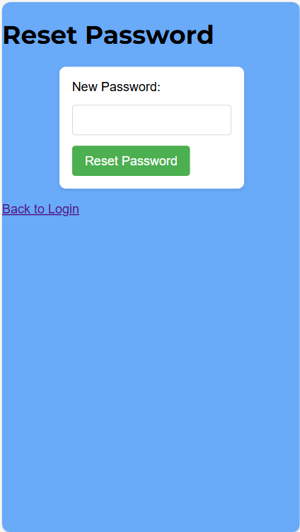

# [MyRecipeApp: Personal Recipe Collection App](https.herokuapp.com)

# Project Overview

[MyRecipeApp](https:.herokuapp.com) is a [Flask](https://flask.palletsprojects.com/en/stable/)-based [CRUD](https://www.codecademy.com/article/what-is-crud) application that lets users manage their recipe collection with ease of use. Users can create secure accounts or log in using hashed passwords powered by [bcrypt](https://flask-bcrypt.readthedocs.io/en/1.0.1/), and perform actions like adding, editing, deleting, and searching for recipes that havebeen stored in a [MongoDB](https://www.mongodb.com/) database. The app features a dynamic and responsive interface styled with custom css, while [JavaScript](https://www.w3schools.com/js/DEFAULT.asp) enhances interactivity by animating the flashing effect when searching for recipes. My Reciep App allows for an intuitive experience for managing your recipes in a secure account authenticated by a password and data that is managed in a collection. This allows for posiitve user experiences and ease of use.

**Key Features:**
- User Authentication & Security: Leverages Flask-Bcrypt for secure password hashing and implements a safe login and registration process.
- Dynamic Recipe Management: Easily add, edit, delete, and view recipes in a personalized collection with full CRUD functionality.
- User-Centric Dashboard: Provides a customized experience where users can manage their recipes efficiently.
- Recipe Search Optimization: Fast and intuitive recipe search feature, allowing users to quickly find their dishes.
- MongoDB Integration: Utilizes MongoDB to store and manage user and recipe data, ensuring scalability and performance.
- Role-Based Access Control: Ensures secure access with session management, limiting recipe modifications to authenticated users.
- Responsive & Accessible Design: Built with a mobile-first approach, ensuring seamless navigation on all devices with a clean and modern UI.

## UX

When designing a CRUD-based application, a recipe management system offers a compelling and user-centric experience. It allows users to efficiently create, view, edit, and delete their own recipes in a structured, easy-to-navigate environment. The key UX challenge lies in creating a seamless flow for users to interact with their recipe collection, whether they are adding new recipes, searching through them, or modifying existing entries.

The project also introduces personalized user authentication, giving users the ability to manage their own recipes securely. This adds an extra layer of complexity, as the design must account for features like login, session management, and ensuring that users can only access their own recipes. This personalized experience strengthens user interaction, providing the feeling of ownership and control over the data they create.

### Color Scheme

The chosen color palette is designed to create a visually engaging and user-friendly experience while maintaining a clean and modern look. The combination of contrasting colors ensures clear readability, intuitive navigation, and an aesthetically pleasing interface that enhances the overall usability of the application.

**1. Background Colors (#343a40, #69aaf9):**
The dark grey header (#343a40) provides a strong and structured feel, creating a sense of focus and organization. In contrast, the vibrant blue background (#69aaf9) adds a fresh and inviting atmosphere, making the interface feel approachable and easy to navigate.

**2. Action Buttons (#dc3545, #4CAF50, #007bff):**
Key actions are color-coded to improve usability. The red (#dc3545) is used for actions requiring caution, such as "delete," ensuring users can easily distinguish critical functions. The green (#4CAF50) is used for positive actions like saving or submitting, reinforcing a sense of confirmation. Blue (#007bff) highlights interactive elements like editing, making them easily identifiable.

**3. Text & Highlight Colors (#fff, #ff6347, #eeecec):**
White (#fff) text is used against dark backgrounds to maximize readability. Titles and key elements feature a striking coral shade (#ff6347), adding a dynamic and engaging touch. The soft grey (#eeecec) in recipe cards ensures content remains clear and easy to read without overwhelming the user.

By combining bold contrast with subtle highlights, this color scheme creates an intuitive and visually appealing experience while maintaining clarity and ease of use.

### Typography

For this project, I selected a combination of Google Fonts that prioritize readability and modern aesthetics. The chosen fonts create a clear visual hierarchy and contribute to a user-friendly experience, ensuring that content is easily digestible while maintaining a clean and contemporary look.

**Heading Typography**

**H1 [Lobster](https://fonts.google.com/specimen/Lobster)**
I used Lobster for the main title (H1) to give it a bold, playful touch. The cursive design adds character and makes the title stand out in a unique way, giving the page an engaging and inviting feel.

**Subheadings [H2-H6: Montserrat](https://fonts.google.com/specimen/Montserrat)**
Montserrat was chosen for subheadings due to its clean and modern design. It’s easy to read and structured, ensuring the content is well-organized while maintaining a professional and polished appearance.

**Body Text [Open Sans](https://fonts.google.com/specimen/Open+Sans)**
For the body text, I used Open Sans, a highly readable sans-serif font. Its simple and neutral design ensures clarity and legibility, making it ideal for longer text content and enhancing the overall user experience.

**Fallback Font: Sans-serif**
In the event that the primary fonts are unavailable, I’ve set a fallback to sans-serif. This ensures that the text remains clean, simple, and easy to read across all devices, maintaining a consistent user experience.

## User Stories

### New Site Users

- As a new site user, I want to create an account, so that I can store and organize my recipes securely.
- As a new site user, I want to add my favorite recipes, so that I can easily refer back to them later.
- As a new site user, I want to search for recipes by name, so that I can find recipes that I have previously stored.
- As a new site user, I want to easily manage my recipes and delete the old ones I no longer require.

### Returning Users 

- As a returning user, I want to log into my account, so that I can access my personal recipe collection.
- As a returning user, I want to update a recipe with changes I made or improvements I discovered, so that I can keep my recipes up to date.
- As a returning user, I want to delete or archive recipes that I no longer want to keep, so that my collection stays organized and relevant.
- As a returning user, I want to be able to change my password if i somehow forgot my original.

## Wireframes

In order for best practices to be used, I developed wireframes to potray what the website should look like, I have included desktop and mobile view for frames that require a different layout due to sizing for mobile view.
I have used [Wireframe](https://wireframe.cc) to design the wireframes for my site.

### Desktop Wireframes

### Mobile Wireframe

- My signup and login pages are relatively small in terms of layout so they will look similar if not the same from a mobile view. The dashboard howeevr will require a different layout.

## Features

### Existing Features

-**Login Page**

- The login page is a simple one box for a form that allows the user to type theur username and password to click a button to login.

-**Signup Page**

- The signup page allows the user to set their own username and password as well as two security answers, this page will flag up usernames that already exist and only allow the user to set a username and password above a certain length. Don't forget that when setting security answers, it is case sensitive.

-**Forgot Password Page**

- This page allows the user to get to the reset password page by typing in their username and security question answers.

-**Reset Password Page**

- This page allows the user to reet thir password which will then be updated automatically to allow the user to sign in with their new passord.

-**Dashboard Page**

- This page allows the user to log and store new recipes as well as edit and delete them. The user can sign out and can create new recipes with an add recipe form.

